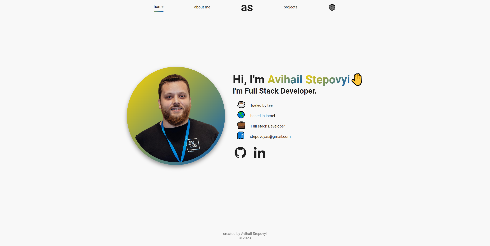

<h1 align="center">Hi, my name is Avi and there's my coding journey</h1>
<h4 align="center">
  &nbsp;
</h4>

<h3 align="center">Full-stack developer | MongoDB, Express.js, React, Node.js</h3>

"Not all dreamers are winners, but all winners are dreamers..."

---
<h3 align="center">Stay in touch:</h3>

&nbsp;

---
<h3 align="center">Technologies and Frameworks:</h3>

&nbsp;
&nbsp;
&nbsp;
&nbsp;
&nbsp;

&nbsp;
&nbsp;
&nbsp;
<a href="https://nodejs.org/en/" target="_blank" rel="noreferrer"> &nbsp;
<a href="https://www.typescriptlang.org/" target="_blank" rel="noreferrer"> 
<a href="https://nextjs.org" target="_blank" rel="noreferrer"> 

  

<a href="https://www.figma.com/" target="_blank" rel="noreferrer"> &nbsp;
<a href="https://www.postman.com/" target="_blank" rel="noreferrer"> &nbsp;  
<a href="https://cloud.google.com" target="_blank" rel="noreferrer"> &nbsp;
<a href="https://jestjs.io" target="_blank" rel="noreferrer"> &nbsp;
<a href="https://www.nginx.com" target="_blank" rel="noreferrer"> &nbsp;
<a href="https://jwt.io/" target="_blank" rel="noreferrer"> 

 

---
